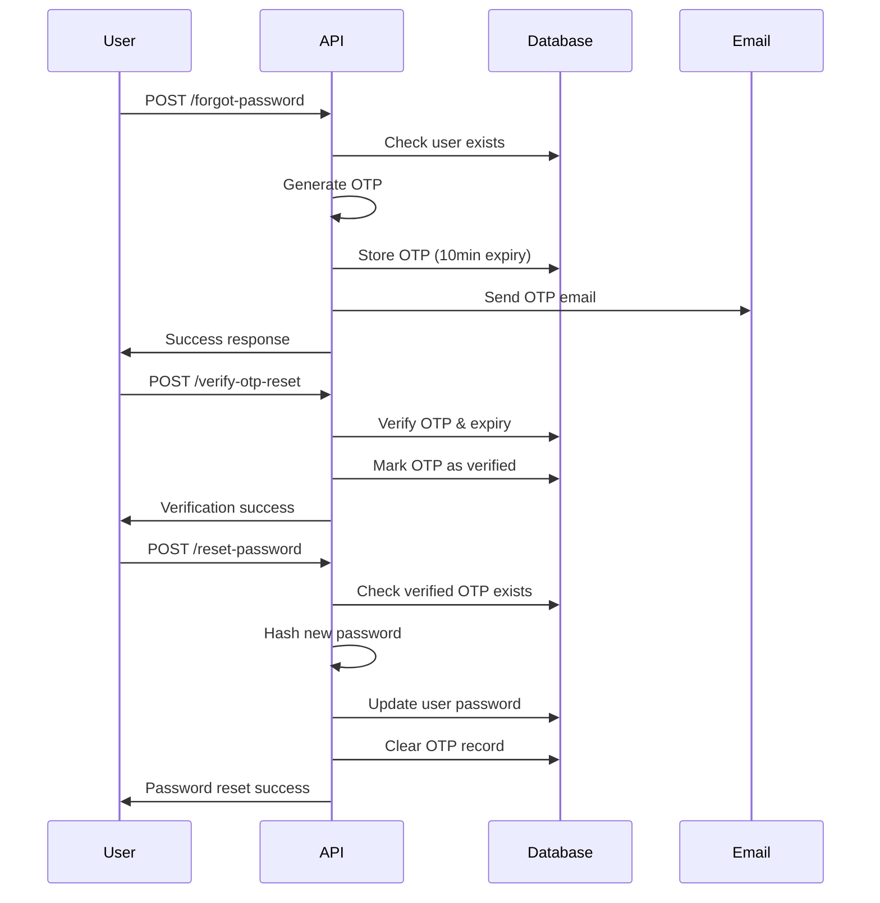

# Secure Forgot Password Flow Implementation

This document describes the implementation of a secure 3-step forgot password flow using Express.js, MongoDB, and JWT authentication.

## 🏗️ Architecture

The implementation follows a clean modular structure:

```
├── controllers/
│   └── authController.js          # Business logic for auth operations
├── models/
│   ├── User.js                    # User schema with password hashing
│   └── Otp.js                     # OTP schema with expiration
├── routes/
│   └── authRoutes.js              # API route definitions
├── middleware/
│   ├── authMiddleware.js          # JWT authentication middleware
│   └── errorHandler.js            # Centralized error handling
├── validators/
│   └── authValidators.js          # Input validation rules
└── utils/
    ├── generateToken.js           # JWT token utilities
    └── generateOtp.js             # OTP generation and email sending
```

## 🔐 Security Features

### 1. **OTP Security**
- 6-digit numeric OTP generation
- 10-minute expiration time
- Automatic cleanup of expired OTPs
- One-time use (deleted after verification)
- MongoDB TTL index for automatic expiration

### 2. **Password Security**
- bcrypt hashing with salt rounds of 10
- Strong password validation requirements:
  - Minimum 8 characters
  - At least one uppercase letter
  - At least one lowercase letter
  - At least one number
  - At least one special character

### 3. **Flow Security**
- 3-step verification process
- OTP verification required before password reset
- Email validation and normalization
- Comprehensive input validation

## 📋 API Endpoints

### 1. **POST /api/auth/forgot-password**
Request password reset by email.

**Request Body:**
```json
{
  "email": "user@example.com"
}
```

**Response:**
```json
{
  "success": true,
  "message": "OTP sent to email successfully"
}
```

**Features:**
- Validates email format
- Checks if user exists
- Generates 6-digit OTP
- Stores OTP with 10-minute expiration
- Sends OTP via email (console.log for development)

### 2. **POST /api/auth/verify-otp-reset**
Verify OTP for password reset.

**Request Body:**
```json
{
  "email": "user@example.com",
  "otp": "123456"
}
```

**Response:**
```json
{
  "success": true,
  "message": "OTP verified successfully. You can now reset your password."
}
```

**Features:**
- Validates OTP format (6 digits)
- Checks OTP expiration
- Marks OTP as verified (`isVerified: true`)
- Allows only one verification per OTP

### 3. **POST /api/auth/reset-password**
Reset password after OTP verification.

**Request Body:**
```json
{
  "email": "user@example.com",
  "newPassword": "NewSecurePass123!"
}
```

**Response:**
```json
{
  "success": true,
  "message": "Password reset successful"
}
```

**Features:**
- Requires verified OTP for the email
- Validates password strength
- Hashes password with bcrypt
- Clears OTP record after successful reset

## 🔄 Complete Flow



## 🛠️ Implementation Details

### OTP Model Schema
```javascript
{
  email: String (required, lowercase),
  otp: String (required, 6 digits),
  isVerified: Boolean (default: false),
  expiresAt: Date (required, 10 minutes from creation),
  createdAt: Date (default: now)
}
```

### Security Validations
- **Email**: Required, valid format, normalized
- **OTP**: Required, 6 digits, numeric only
- **Password**: Required, minimum 8 chars, complexity requirements

### Error Handling
- Comprehensive error responses
- Validation error formatting
- Centralized error middleware
- Proper HTTP status codes

## 🧪 Testing

### Manual Testing
1. Start the server: `npm run dev`
2. Use the provided curl commands in `test-forgot-password-flow.js`
3. Check console for OTP details
4. Follow the 3-step flow

### Test Scenarios
- ✅ Valid email, valid OTP, strong password
- ❌ Invalid email format
- ❌ Non-existent user
- ❌ Invalid/expired OTP
- ❌ Weak password
- ❌ Reset password without OTP verification

## 📧 Email Integration

The current implementation logs OTPs to console for development. To integrate real email sending:

1. Install nodemailer: `npm install nodemailer`
2. Set environment variables:
   ```
   EMAIL_USER=your-email@gmail.com
   EMAIL_PASS=your-app-password
   ```
3. Uncomment and configure the email code in `utils/generateOtp.js`

## 🔧 Environment Variables

Required environment variables:
```
MONGODB_URI=mongodb://localhost:27017/your-database
JWT_SECRET=your-jwt-secret
JWT_REFRESH_SECRET=your-refresh-secret
```

## 🚀 Deployment Considerations

1. **Security**:
   - Use HTTPS in production
   - Set secure JWT secrets
   - Configure proper CORS settings
   - Rate limiting for OTP requests

2. **Email Service**:
   - Use production email service (SendGrid, AWS SES, etc.)
   - Configure proper email templates
   - Handle email delivery failures

3. **Database**:
   - Use production MongoDB instance
   - Configure proper indexes
   - Set up monitoring and backups

4. **Monitoring**:
   - Log OTP generation and verification
   - Monitor failed password reset attempts
   - Set up alerts for suspicious activity

## 📝 Notes

- OTPs are automatically cleaned up after expiration using MongoDB TTL indexes
- The flow prevents password reset without OTP verification
- All passwords are hashed using bcrypt with salt rounds of 10
- Input validation prevents common security vulnerabilities
- Error messages are user-friendly but don't leak sensitive information 